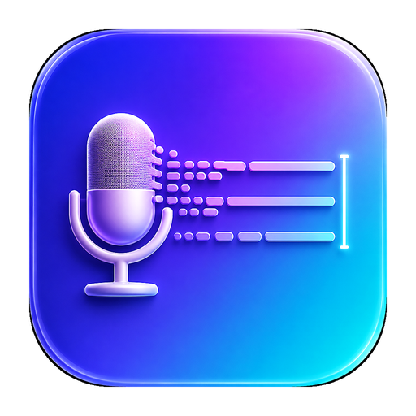

<p align="center">
  
</p>

<h1 align="center">typeformic</h1>

<p align="center">
  <b>Speak anywhere. It types for you.</b><br>
  A tiny macOS menu-bar tool that turns your voice into clean text and types it
  straight into whatever app is in front of you.
</p>

<p align="center">
  
  
  
</p>

---

## What it is

typeformic is a press-to-talk dictation utility. Hit a global hotkey, say a
sentence, and it transcribes your speech on-device, cleans it up with a language
model, and **types the result at your cursor** — in any text field, in any app.
No window to switch to, no copy-paste.

It was built for fast, hands-on text entry: chat, code comments, commit
messages, notes — anywhere you can type, you can talk instead.

## Features

- 🎙️ **On-device transcription** — Apple's `SpeechAnalyzer` / `SpeechTranscriber`
  (macOS 26). Audio never leaves your Mac for speech-to-text.
- 🤚 **Auto-stop on silence** — a lightweight VAD ends the utterance ~1.5s after
  you stop talking. Nothing to press to finish.
- ✨ **LLM cleanup** — strips filler words, fixes punctuation, and restores
  mis-transcribed technical terms (e.g. 派森 → Python, 吉特哈勃 → GitHub).
- 🔌 **Bring your own model** — switch between the on-device model, any
  **OpenAI-compatible** endpoint, or the **Anthropic** API. Base URL, key,
  model name, and the cleanup prompt are all configurable, with a one-click
  connection test.
- ⌨️ **Types anywhere** — output is injected as real keystrokes via `CGEvent`,
  so it lands in the frontmost app exactly where your cursor is. The pasteboard
  is never touched.
- 🌐 **Multi-language** — pick your dictation language; models download on first
  use.
- 🫧 **Stays out of the way** — a small wake pill fades in at the bottom of the
  screen while you talk and disappears when you're done. A stats panel tracks
  dictations / characters / corrections.

## How it works

```
⌃⌥M ─▶ mic ─▶ SpeechTranscriber ─▶ VAD auto-stop ─▶ LLM cleanup ─▶ CGEvent keystrokes ─▶ frontmost app
```

1. A global Carbon hotkey wakes the pill and starts the audio engine.
2. Microphone buffers stream into `SpeechAnalyzer` for live transcription.
3. Per-buffer RMS energy drives a voice-activity detector that auto-finalizes
   after a trailing silence.
4. The raw transcript is cleaned by the selected engine (on-device / OpenAI /
   Anthropic).
5. The cleaned text is typed into the frontmost app via synthesized Unicode key
   events.

## Requirements

- macOS **26 (Tahoe)** or later, Apple Silicon
- Xcode 26+
- Apple Intelligence enabled (for the on-device cleanup model). Remote APIs work
  without it.

## Build & run

```bash
git clone git@github.com:uk0/typeformic.git
cd typeformic
open MicMix.xcodeproj   # the Xcode target / scheme is "MicMix"
# ⌘R to build & run
```

> The repository is named **typeformic**; the Xcode app target is `MicMix`.
> Build and run the `MicMix` scheme. The app lives in the menu bar (mic icon) —
> there is no Dock icon.

## Permissions

On first use macOS asks for three permissions — all are required for the tool to
work end-to-end:

| Permission | Why | Where |
|---|---|---|
| **Microphone** | capture your voice | prompted on first dictation |
| **Speech Recognition** | transcribe audio | prompted on first dictation |
| **Accessibility** | type into other apps | System Settings → Privacy & Security → Accessibility (grant manually) |

The app is **not** sandboxed — system-wide keystroke injection is incompatible
with the App Sandbox — and ships with Hardened Runtime plus the audio-input
entitlement.

## Configuration

Menu bar → **Settings…** (⌘,):

- **Dictation → Language** — speech-recognition locale (Auto, or pick one).
- **Cleanup Engine** — On-device (Apple) or Remote API.
- **Model API** — provider (OpenAI-compatible / Anthropic), base URL, API key,
  model name, and a **Test Connection** button.
- **Cleanup Prompt** — the instructions used to tidy the transcript; editable,
  with reset-to-default.

API keys are stored locally in `UserDefaults`.

## Usage

| Action | Shortcut |
|---|---|
| Start / stop dictation | **⌃⌥M** (Control-Option-M) |
| Show / hide the pill | menu bar → Show / Hide Widget |
| Open settings | ⌘, |
| Statistics | menu bar → Statistics… |

Put your cursor in any text field, press **⌃⌥M**, speak, and pause — the cleaned
text appears.

## License

[MIT](LICENSE)
